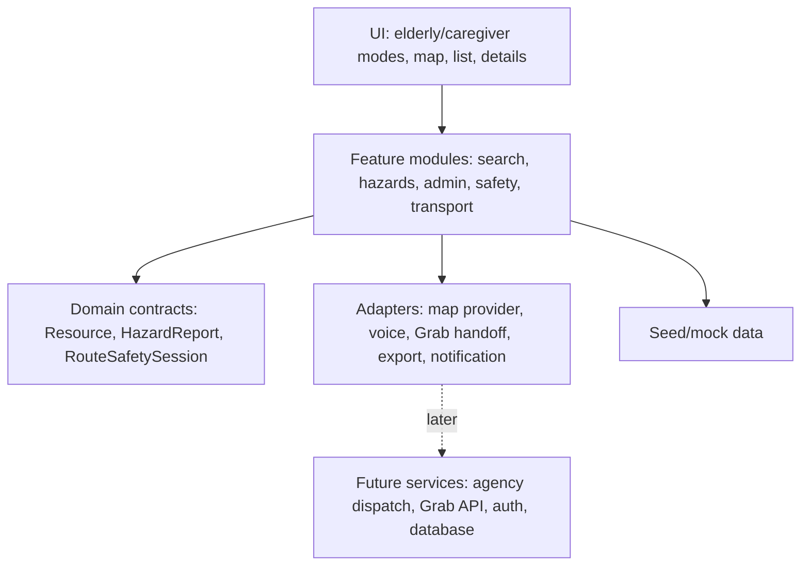

# System Design

## Architecture Goal

Build a hackathon MVP that can be implemented quickly with seeded data, while keeping the major future integrations replaceable: map provider, transport handoff, hazard routing, and notifications.

## Recommended Stack

If no app stack has been chosen yet, use:

- Frontend: Next.js or Vite React with TypeScript.
- Styling: Tailwind CSS or CSS modules.
- Map rendering: Leaflet/MapLibre or the selected framework's map wrapper.
- Data: local JSON seed data first.
- State: simple React state or lightweight store.
- Export: browser-generated CSV/JSON.
- Voice: browser speech recognition where available, fallback to text.
- Notifications: in-app/demo notification first.

The MVP does not require a backend unless the team needs persistence across devices.

## Layered Design

## Core Modules

### Resource Discovery

Responsibilities:

- Load resources.
- Filter by category, verification, open now, language, free/paid, hazard status.
- Render map and list from the same filtered result set.
- Search by typed input or voice transcript.

### Resource Detail

Responsibilities:

- Show practical access notes.
- Show category-specific details.
- Show verification and confidence status.
- Provide share/copy actions.

### Hazard Reporting

Responsibilities:

- Submit hazard or maintenance report.
- Link report to resource or route segment where possible.
- Show public status without overclaiming.
- Let admin review and export.

### Admin Review

Responsibilities:

- Review resource submissions.
- Review hazard reports.
- Update status.
- Export CSV/JSON.

### Mode and Voice

Responsibilities:

- Switch elderly/caregiver UI.
- Persist mode for session.
- Provide voice search.
- Provide spoken guidance text/audio where supported.
- Maintain full non-voice fallback.

### Transport Handoff

Responsibilities:

- Build a destination/pickup payload from shared data.
- Open Grab deep link where supported.
- Provide copyable fallback.
- Avoid bookings, payments, or driver allocation.

### Route Safety

Responsibilities:

- Start an opt-in route safety session.
- Compare current/simulated location to route corridor.
- Trigger caregiver ping when deviation threshold is crossed.
- Stop tracking when session ends.

## Data Flow

1. Seed data loads resources, hazards, and demo route.
2. Search/filter produces visible resources.
3. Map/list render visible resources.
4. Selecting a resource opens detail.
5. User can share, open Grab handoff, report hazard, or start route safety.
6. Hazard/admin state updates local app state.
7. Export serializes reviewed hazard reports.

## Adapter Boundaries

Keep these as replaceable modules:

- `mapAdapter`: render map, geocode/search, route overlay.
- `voiceAdapter`: listen, stop, return transcript.
- `transportAdapter`: build Grab URL or copy text.
- `exportAdapter`: CSV/JSON generation.
- `notificationAdapter`: in-app alert now, SMS/push later.

## MVP Persistence

Use local state and seeded JSON for speed. If persistence is needed:

- Use localStorage for UI mode and demo sessions.
- Use mock in-memory admin state for judging.
- Avoid adding auth/database unless the team has spare time.

## Security and Privacy

- No medical diagnosis fields.
- No permanent route traces.
- No secrets in frontend code.
- Consent required before safety ping session.
- Photos should avoid identifiable people.

## System Extension Points

- Agency dispatch can consume hazard export.
- Grab partnership can replace deep-link adapter.
- Database can replace seed data.
- Push/SMS can replace demo notification adapter.
- Street View/AR can become a route preview adapter later.
