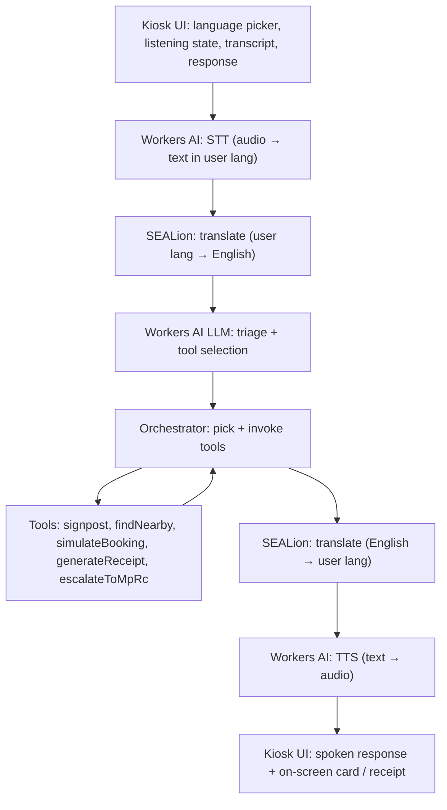

# System Design

## Architecture Goal

Build a hackathon MVP **voice kiosk for elderly residents in HDB void decks**: voice-first triage in their language, signposting to the right agency / hotline / local resource, and structured-case escalation to MP/RC volunteers. Demo runs on laptops. The major future integrations stay replaceable: speech provider, LLM, MP/RC export channel, map provider, transport handoff, agency APIs.

## Stack

The stack is locked in `tech-stack.md`. In short:

- **Frontend:** Next.js 16 (App Router) + React 19 + TypeScript + Tailwind v4 + shadcn/ui in `src/`. Hosted on Cloudflare Pages.
- **Backend:** Cloudflare Workers (TypeScript) in `workers/` (planned). Owns the orchestrator and all tool implementations.
- **AI:** Cloudflare Workers AI for STT, TTS, and triage LLM. SEALion for SEA-language translation.
- **Database:** Cloudflare D1 (SQLite). Seed data ships as D1 migrations.
- **Object storage:** Cloudflare R2 for receipt PDFs.
- **Session state:** Cloudflare KV for short-lived multi-turn context.
- **Auth:** none in MVP. Kiosk is anonymous.
- **Map (NTH):** react-leaflet behind a `mapAdapter`, with OneMap tiles + Barrier-Free Access API.
- **Browser fallback:** Web Speech API + touch input as a last resort if the Cloudflare path fails on stage.

## Pipeline

The orchestrator can re-enter triage with a follow-up question (multi-turn, bounded to ~3 follow-ups) before the response leaves the Worker.

## Core Modules

### Kiosk Voice Pipeline (MVP)

Responsibilities:

- Capture audio in the user's language and stream to the Worker.
- Render listening state, transcript, and response (with on-screen card for visual fallback).
- Maintain a per-session ID linked to KV-backed session state.
- Handle multi-turn follow-ups without losing prior context.
- Provide a touch / text fallback for any user that can't or won't speak.

### Triage + Orchestrator (MVP)

Responsibilities:

- Translate input from user language to English.
- Run the LLM with an **allowlisted** tool registry (`signpost`, `findNearby`, `simulateBooking`, `generateReceipt`, `escalateToMpRc`).
- Apply bounded follow-ups when the request is underspecified (≤3).
- Translate the final response back to the user's language.
- Log every utterance and tool invocation in D1 for the receipt + MP/RC case.

### Signposting + Booking Tools (MVP)

Responsibilities:

- `signpost(agencyKey)` — return a curated `AgencyContact` (agency name, hotline, address, opening hours, multilingual blurb).
- `findNearby(category)` — query D1 for nearby resources by category. NTH frontend renders a map; MVP returns a text/voice description with walking direction.
- `simulateBooking(agencyKey, slot)` — return a `BookingConfirmation` (preset outcomes for demo).
- The triage LLM only sees this allowlisted tool surface — it cannot fabricate hotlines.

### Receipt (MVP)

Responsibilities:

- Render a PDF receipt summarising the case (transcript snippet, language, signposted agency, simulated booking detail, case ID).
- Store the PDF in R2; return a signed URL.
- Kiosk displays it full-screen ("printer not present in demo").

### MP/RC Case Export (MVP)

Responsibilities:

- For complex cases, write a `Case` row in D1 with structured fields (transcript, language, English summary, suggested next steps, kiosk location, optional resident block/unit alias).
- Export queued cases via an `mpRcExportAdapter` (default: signed CSV download URL; alt: webhook; alt: Cloudflare Email Routing).
- MP/RC volunteers consume cases in their existing dashboards. We do not build one.

### Resource Discovery + Map + Wheelchair Routing (NTH — high priority among NTH)

Responsibilities:

- List/filter elderly-friendly services.
- Render map and list from the same filtered set.
- OneMap Barrier-Free routing to a chosen destination.
- Reuses `Resource` data contract.

### Hazard Reporting, Mode Switch, Grab Handoff, Route Safety (NTH — low priority)

Held over from the prior product. Build only after MVP is solid. Adapter shapes preserved in `integration-boundaries.md`.

## Data Flow (MVP happy path)

1. Resident taps the kiosk language tile. Session ID created in KV.
2. Resident speaks; audio streams to the Worker.
3. Worker runs STT → translate (user → English).
4. Triage LLM picks a tool. If underspecified, returns a follow-up question (loop with bounded retry).
5. Tool returns a structured result (signpost / nearby / simulated booking / escalation).
6. Worker generates the response in English, translates back to the user's language, runs TTS.
7. Kiosk plays audio + shows the response card.
8. If a receipt is generated, the kiosk shows it full-screen with a "go back" button.
9. If escalated, the `Case` is written; the export adapter fires per its configured channel.
10. Idle timer resets the kiosk after 30s of inactivity (privacy).

## Adapter Boundaries

Keep these as replaceable modules (full list and rules in `integration-boundaries.md`):

- `sttAdapter` — audio → text in user language.
- `translateAdapter` — bidirectional user lang ↔ English.
- `llmAdapter` — triage + tool calling.
- `ttsAdapter` — text → audio.
- `agentToolAdapter` — registry of tools the LLM is allowed to call.
- `receiptAdapter` — render and store the receipt.
- `mpRcExportAdapter` — push structured cases to MP/RC tooling.
- `mapAdapter` (NTH) — render map, geocode, route overlay.
- `transportAdapter` (NTH) — Grab deep-link.
- `notificationAdapter` (NTH) — in-app demo alert; SMS/push later.

## Persistence

- Cloudflare D1 is the single database. Schema driven by `data-contracts.md`.
- Seed data ships as D1 migration files (`AgencyContact` directory, sample resources for the NTH map).
- Cloudflare KV holds short-lived per-session state for multi-turn dialogues; expires on idle reset.
- Cloudflare R2 holds receipt PDFs (and optional debug audio, retained only for the session).

## Security and Privacy

- Anonymous by default. Identity capture is optional and only when needed; never NRIC.
- No medical diagnosis fields.
- No permanent voice retention. Audio is used for STT only; transcripts are retained for the case + receipt; KV session is cleared on idle reset.
- Consent banner before the first listening session.
- No secrets in frontend code. All AI keys live in `wrangler secret`.

## System Extension Points

- Real agency integrations replace `simulateBooking` once partnerships are signed.
- NGO linking layered onto the escalation flow with optional identity capture.
- Browser Web Speech fallback can be promoted from emergency safety net to a primary path for English-only requests if the network is unreliable.
- Map / wheelchair routing is already adapter-shaped; promote from NTH to MVP+1.
- MP/RC export channel can move from CSV to webhook as soon as a real MP volunteer dashboard is identified.
