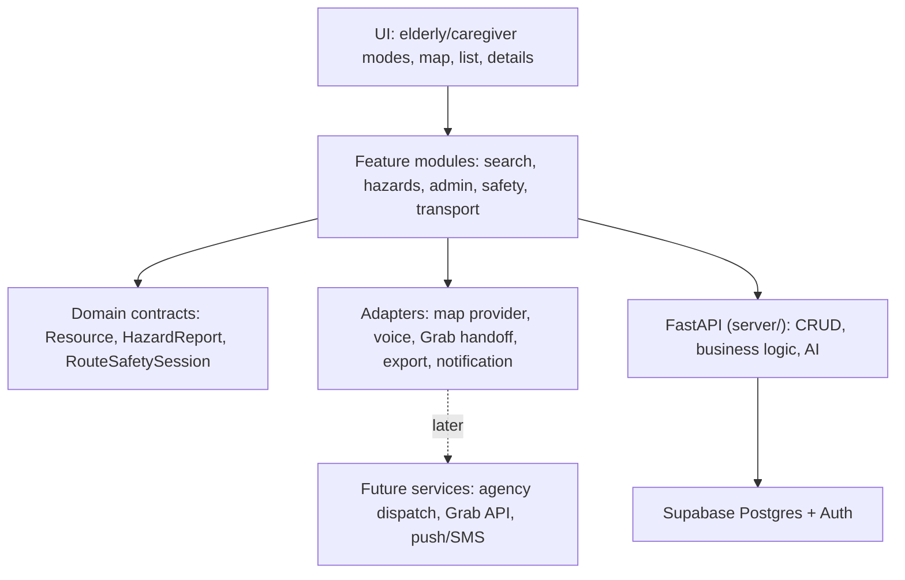

# System Design

## Architecture Goal

Build a hackathon MVP that can be implemented quickly with seeded data, while keeping the major future integrations replaceable: map provider, transport handoff, hazard routing, and notifications.

## Stack

The stack is locked in `tech-stack.md`. In short:

- **Web:** Next.js 16 (App Router) + React 19 + TypeScript + Tailwind v4 + shadcn/ui in `src/`.
- **API:** FastAPI + `supabase-py` + Pydantic v2 in `server/`. Owns all CRUD, business logic, and (planned) AI endpoints.
- **Persistence:** Supabase Postgres. Seed data ships as Supabase migrations under `supabase/migrations/`, not in-app JSON.
- **Auth:** Supabase magic-link, proxied through FastAPI. The browser never imports or calls Supabase directly.
- **Map:** react-leaflet (planned) behind a `mapAdapter`, with OneMap tiles + Barrier-Free Access API.
- **Voice:** browser Web Speech API + `SpeechSynthesis` (planned), with text/touch fallback.
- **Export:** browser-generated CSV/JSON.
- **Notifications:** in-app/demo notification first.

## Layered Design

## Core Modules

### Resource Discovery

Responsibilities:

- Load resources.
- Filter by category, verification, open now, language, free/paid, hazard status.
- Render map and list from the same filtered result set.
- Search by typed input or voice transcript.

### Resource Detail

Responsibilities:

- Show practical access notes.
- Show category-specific details.
- Show verification and confidence status.
- Provide share/copy actions.

### Hazard Reporting

Responsibilities:

- Submit hazard or maintenance report.
- Link report to resource or route segment where possible.
- Show public status without overclaiming.
- Let admin review and export.

### Admin Review

Responsibilities:

- Review resource submissions.
- Review hazard reports.
- Update status.
- Export CSV/JSON.

### Mode and Voice

Responsibilities:

- Switch elderly/caregiver UI.
- Persist mode for session.
- Provide voice search.
- Provide spoken guidance text/audio where supported.
- Maintain full non-voice fallback.

### Transport Handoff

Responsibilities:

- Build a destination/pickup payload from shared data.
- Open Grab deep link where supported.
- Provide copyable fallback.
- Avoid bookings, payments, or driver allocation.

### Route Safety

Responsibilities:

- Start an opt-in route safety session.
- Compare current/simulated location to route corridor.
- Trigger caregiver ping when deviation threshold is crossed.
- Stop tracking when session ends.

## Data Flow

1. Resources, hazards, and demo routes load from Supabase via FastAPI.
2. Search/filter produces visible resources.
3. Map/list render visible resources.
4. Selecting a resource opens detail.
5. User can share, open Grab handoff, report hazard, or start route safety.
6. Hazard reports and admin reviews persist via FastAPI to Supabase.
7. Export serializes reviewed hazard reports from FastAPI as CSV/JSON.

## Adapter Boundaries

Keep these as replaceable modules:

- `mapAdapter`: render map, geocode/search, route overlay.
- `voiceAdapter`: listen, stop, return transcript.
- `transportAdapter`: build Grab URL or copy text.
- `exportAdapter`: CSV/JSON generation.
- `notificationAdapter`: in-app alert now, SMS/push later.

## MVP Persistence

Persistence is **Supabase Postgres**, accessed only through FastAPI's `supabase-py` client (`server/supabase_client.py`). Seed data ships as Supabase migrations under `supabase/migrations/`, not as in-app JSON.

- Auth is shipped: magic-link via FastAPI proxy. The browser never imports or calls Supabase directly.
- RLS is **not** user-scoped in MVP — auth-sensitive logic lives in FastAPI route handlers and Pydantic models. See `tech-stack.md` "Architecture rules".
- localStorage is fine for UI mode and other ephemeral client-only state. Anything cross-device goes through FastAPI.

## Security and Privacy

- No medical diagnosis fields.
- No permanent route traces.
- No secrets in frontend code.
- Consent required before safety ping session.
- Photos should avoid identifiable people.

## System Extension Points

- Agency dispatch can consume hazard export from FastAPI.
- Grab partnership can replace the deep-link adapter.
- Push/SMS can replace the demo notification adapter.
- Street View/AR can become a route preview adapter later.
- LangChain + Anthropic plug into FastAPI route handlers when AI features are picked up (see `tech-stack.md`).
